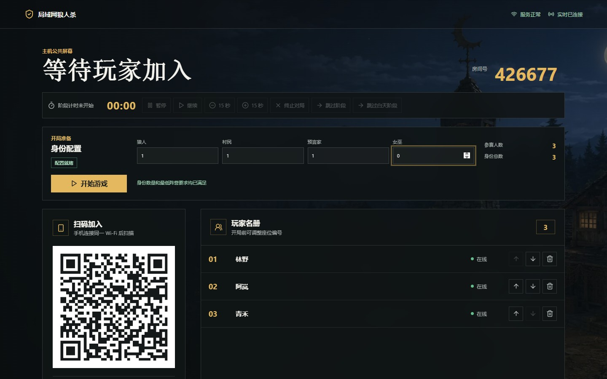
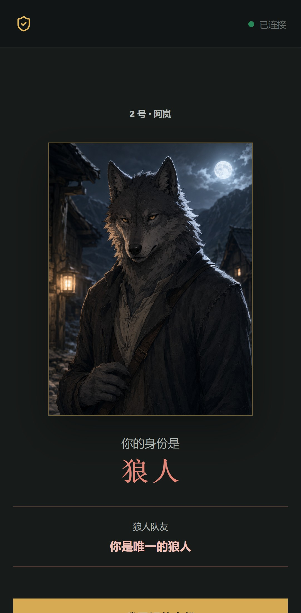
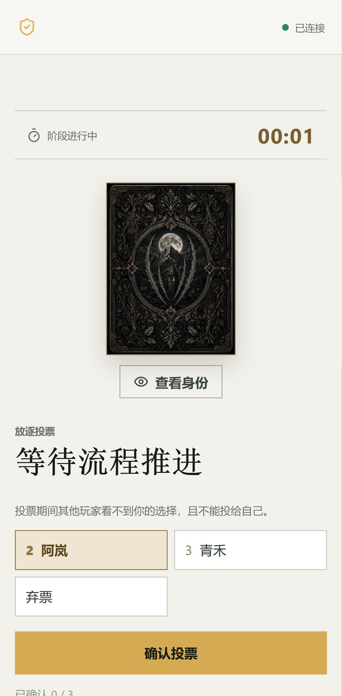

# W_SHA 局域网狼人杀

一款面向线下聚会的局域网狼人杀辅助系统。Windows 电脑作为房主和公共屏幕，玩家手机连接同一局域网后，通过扫描二维码在浏览器中加入，无需安装手机 App，也不依赖云服务器。

## 游戏界面

电脑作为房主公共屏幕，用于创建房间、展示二维码、配置身份和控制游戏流程。



玩家通过手机浏览器查看自己的私密身份，并完成夜间行动、白天发言和放逐投票。

<p align="center">
  
  &nbsp;&nbsp;
  
</p>

对局结束后，公共屏幕统一公布胜负、全部身份和关键行动记录。


## 主要功能

- 房主创建房间、配置角色和阶段时间
- 自动分配狼人、村民、预言家、女巫、守卫、猎人和白痴身份
- 夜间行动、白天发言、投票放逐和胜负判断
- 玩家断线重连与新设备接管
- 游戏状态本地持久化
- 房主暂停、继续、跳过阶段及处理异常玩家
- 同一阶段玩家全部完成操作后自动推进

## 普通用户使用

推荐使用 Windows 安装版：

1. 运行 `release/W_SHA-Setup-0.1.0.exe` 并完成安装。
2. 从桌面或开始菜单启动“W_SHA 局域网狼人杀”。
3. 浏览器会自动打开房主控制台。
4. 所有玩家连接与主机相同的 Wi-Fi。
5. 玩家扫描房主页面上的二维码加入游戏。

也可以使用免安装版：

1. 解压 `release/W_SHA-portable-0.1.0.zip`。
2. 双击 `启动狼人杀.cmd`。
3. 游戏期间不要关闭命令窗口，关闭窗口会停止服务。

接收方不需要安装 Node.js、pnpm 或数据库软件。

## 局域网与数据

- 安装版会自动添加仅允许本地子网访问的 Windows 防火墙规则，覆盖专用和公用网络配置。
- 便携版首次启动时如出现防火墙提示，请允许当前可信局域网（专用或公用网络）访问。
- 手机和主机必须处于允许设备互访的同一局域网。
- 生产版默认使用端口 `35173`。
- 游戏数据保存在 `%LOCALAPPDATA%\W_SHA\werewolf.sqlite`。
- AI 凭据由服务端自动加密；Windows 版本使用当前用户 DPAPI 保护同目录的 `ai-master-key`，旧版明文 Base64 文件会在首次启动时迁移，请勿单独删除该文件。
- 卸载程序不会自动删除游戏数据。

## 源码开发

环境要求：

- Windows 10/11
- Node.js 22 或更高版本
- Corepack

在项目根目录执行：

```powershell
corepack pnpm install
corepack pnpm dev
```

开发模式会同时启动 Fastify 服务端和 Vite 前端。
首次保存 AI 凭据时无需手动配置密钥；服务端会在数据库目录自动生成 `ai-master-key`。无界面部署也可以通过 `AI_MASTER_KEY` 显式提供 Base64 编码的 32 字节密钥。

AI 多座位共用房间级 token 上限可通过 `AI_GAME_TOKEN_BUDGET` 配置，默认值为 `100000`；单模型/单座位仍受模型档案中的 `gameTokenBudget` 限制。调用失败、预算耗尽或配置版本不一致时，机器人会回退到确定性策略，审计记录可由主持人本机的 `/api/admin/ai/usage` 查看。

## 常用命令

```powershell
# 类型检查
corepack pnpm typecheck

# 单元与集成测试
corepack pnpm test

# Playwright 端到端测试
corepack pnpm test:e2e

# 重新生成 README 游戏截图
corepack pnpm screenshots:readme

# 生产构建
corepack pnpm build

# 类型检查、测试和构建
corepack pnpm check

# 包含端到端测试的完整校验
corepack pnpm check:all
```

## Windows 打包

最简单的方式是在项目根目录双击：

```text
一键打包.cmd
```

脚本会依次完成项目检查、便携版打包、成品自检和安装版编译。成功后会自动打开 `release/` 目录。

首次打包前需要安装 Node.js 22 或更高版本、项目依赖以及 [Inno Setup 6](https://jrsoftware.org/isinfo.php)。

也可以通过命令行分别执行：

生成内置 Node.js、可直接分发的便携版：

```powershell
corepack pnpm package:portable
```

生成 Windows 安装包：

```powershell
corepack pnpm package:installer
```

安装包构建需要本机安装 [Inno Setup 6](https://jrsoftware.org/isinfo.php)。生成结果位于 `release/`，该目录属于构建产物，不应提交到 Git。

打包完成后可检查 ZIP 内容、安装包格式和最终 SHA256：

```powershell
corepack pnpm verify:release
```

该检查不执行安装器，不替代真实 Windows 安装、防火墙和卸载验收。

## 发布前局域网烟测

便携版生成后，可在 Windows 主机上运行生产服务的局域网烟测。它会验证 LAN 主页、加入链接、Socket 来源白名单、主机接口隔离、跨 Socket/跨服务重启 action 重放、快照重启恢复和玩家重连；这不能替代 Android、iPhone 或微信浏览器的实机完整对局：

```powershell
corepack pnpm verify:lan
```

烟测默认使用生产固定端口 `35173`，因此能覆盖安装版启动脚本和防火墙规则对应的端口。若开发机上的 `35173` 已被占用，可临时使用动态端口，但这不能替代固定端口验证：

```powershell
$env:RELEASE_PORT = "0"
corepack pnpm verify:lan
Remove-Item Env:RELEASE_PORT
```

如果主机有多个网卡，可显式指定二维码应公布的 IPv4 地址：

```powershell
$env:LAN_ADDRESS = "192.168.1.20"
corepack pnpm verify:lan
```

真实设备验收请按 [docs/release-acceptance.md](docs/release-acceptance.md) 记录结果。

如需确认便携发布包中的生产静态资源能在桌面、Android 尺寸、iPhone 尺寸和微信 User-Agent 下实际启动，可运行：

```powershell
corepack pnpm verify:package:ui
```

该检查使用本机 Playwright 浏览器验证发布包，不替代真实设备验收。

## 项目结构

```text
apps/web/          React + Vite 前端
apps/server/       Fastify + Socket.IO 服务端
packages/shared/   前后端共享类型、Schema 和事件协议
tests/e2e/         Playwright 端到端测试
docs/              产品、规则、架构和路线文档
scripts/           清理、验证和打包脚本
installer/         Inno Setup 安装脚本
release-template/  便携版启动文件和使用说明
```

## 技术栈

- TypeScript
- React + Vite
- Node.js + Fastify
- Socket.IO
- Zod
- SQLite
- Vitest + Playwright
- pnpm workspace

更详细的说明见：

- [产品说明](docs/product.md)
- [游戏规则](docs/game-rules.md)
- [技术架构](docs/architecture.md)
- [开发路线](docs/roadmap.md)

## 注意事项

- 当前安装包未进行数字签名，Windows 可能显示“未知发布者”。
- 房主电脑不能休眠或关闭游戏命令窗口，否则其他玩家会断开连接。
- 本项目当前设计为同一时间运行一个房间。
